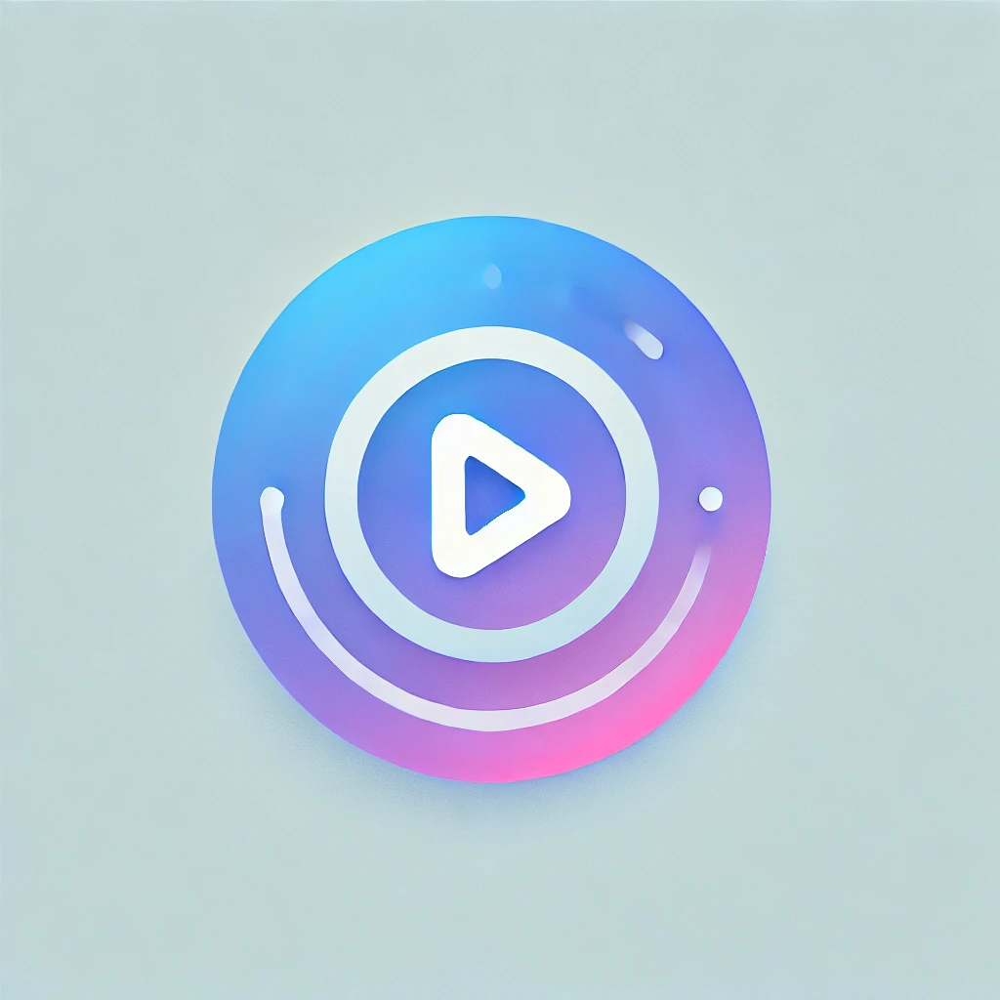

  
  <h2 align="center">
    JamBox-Web
  </h2>

  

    🎵 Play your favorite music right into your favorite browser 🎵
     
    <a href="https://dilkhush00.github.io/JamBox-Web/">Website</a>
    ·
    <a href="https://github.com/DIlkhush00/JamBox-Web/issues">Issues</a>
  

## About the Project
**JamBox-Web** is a simple and user-friendly web music player that allows you to upload and play your favorite songs directly in your browser. 

## Features
- **Unlimited Uploads**: Upload any number of audio files.
- **Universal Audio Format Support**: Compatible with all major audio formats.
- **Cross-Browser Compatibility**: Works on all modern browsers.
- **Music Playback**: Play and enjoy your uploaded songs instantly.

## Upcoming Features (Coming Soon 🚀)
 - **Light and Dark Mode**: Switch between themes to suit your preference.
 - **Multiple Playlists**: Create and manage multiple playlists.
 - **Cloud Storage**: Save your playlists to the cloud and access them anywhere.

## Contribution
You could help by:

- [Contribute to the source code](./CONTRIBUTING.md)
- [Suggest new features and report issues](https://github.com/DIlkhush00/JamBox-Web/issues)

## License
JamBox-Web is free and open source project licensed under the [MIT License](./LICENSE.md).
